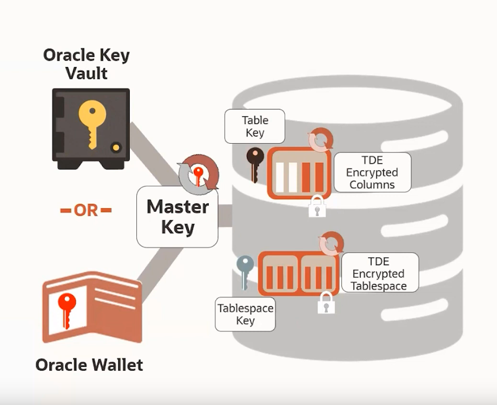

# Oracle19c TDE (Transparent Data Encryption)


## 1. Introduction 

TDE (Transparent Data Encryption) is an Oracle Advance security feature that help us to protect our data from being stolen.
So you may ask why Encryption?
Encryption will secure your data by prevent the attacker to steal your data if he gain access through:

*  Direct access to database storage 
* Theft of database backup 
* Compromise of database export

Check links for more details [1](http://www.dba-oracle.com/t_adv_plsql_tde_keystore.htm) [2](https://orahow.com/configure-auto-login-wallet-in-oracle-19c/) [3](http://www.dba-oracle.com/t_adv_plsql_tde_column_encryption.htm)

## 2. Type of TDE Encryption Targets 

* TableSpace 

  * Encrypt All Datafiles belong to the tablespace
  * Tablespace Key is same for Encrypted datafiles within that Tablespace
  * Default Algorithm AES 128

* Column 

  * Encrypt By column in Table 
  * Table Key is same for all encrypted columns within that table.
  * Default algorithm: AES 192

  

## 3. TDE Key Architecture 

* Master Key 
  * Master Key is a Key stored outside the Database 
  * Master Key is a Key Encrypting key known as (MEK) Master Encryption Key 
  * Master Key used to Encrypt the Table and Tablespace keys 
  * Master Key can be generated By wallet or Key Vault or any other supported HSM  (Hardware Security Modules)
* Tablespace Key
  * Stored and Visible in control file and Datafile Headers 
  * Tablespace key used to encrypt datafiles within the tablespace 
  * Tablespace key encrypted by the master key 
* Table Key 
  * Stored and Visible in table data Dictionary 
  * Its encrypted by master key 
  * Table key used to encrypt columns data within the table 




## 4. TDE Configuration 

### 4.1 TDE with wallet

To work with wallet you need to know few things about it:

* PKCS#12 encrypted Keystore 
* Protected by Passphrase 
* Encrypted with AES256 by default.
* Backup and key distribution is manual 
* Not Secure if the Passphrase is weak and the wallet files are on the same server.

### 4.2 Configure TDE With Wallet 

> Note: You need downtime to configure the TDE with Wallet, and below configuration are applicable on RAC Database. 
>
> Warning: you need to read oracle documentation for more details. 

Using root user install below tool to help you to work easily with sqlplus and other oracle programs and command 

```bash
# for linux 
rpm -Uvh ftp://ftp.pbone.net/mirror/archive.fedoraproject.org/epel/8.1.2020-04-22/Everything/x86_64/Packages/r/rlwrap-0.43-5.el8.x86_64.rpm
```


Using Grid User use `asmcmd` to create asm wallet folder:

```bash
asmcmd mkdir +DATA/wallet
asmcmd mkdir +DATA/wallet/PROD
asmcmd mkdir +DATA/wallet/PROD/tde
asmcmd ls -l +DATA/wallet/PROD
```

Using Oracle user use `sqlplus` to configure wallet:

```bash
show parameter wallet_root
alter system set WALLET_ROOT="+DATA/wallet/PROD" scope=spfile sid='*';
```

Using oracle user restart Database:

```bash
srvctl stop database -db prod
srvctl start database -db prod
-- using sqlplus 
show parameter wallet_root
```


Using Oracle user use `sqlplus` to configure the TDE software Keystore Option:

```sql
show parameter tde_configuration
alter system set TDE_CONFIGURATION="KEYSTORE_CONFIGURATION=FILE" scope=both sid='*';
show parameter tde_configuration

-- check the PDBs if they are in mount (Not Opened)
show pdbs 
alter pluggable database all open;

-- check the status of the wallet 
set lines 200
col WRL_PARAMETER for a25
col wallet_type for a15
col STATUS for a15
select * from GV$ENCRYPTION_WALLET;

-- below command will create a software keystore, check asm you can find a file ewallet.p12, 
ADMINISTER KEY MANAGEMENT CREATE KEYSTORE IDENTIFIED BY "welcome1";

-- command to change the wallet password 

ADMINISTER KEY MANAGEMENT ALTER KEYSTORE PASSWORD IDENTIFIED BY 'welcome1' SET 'password1' WITH BACKUP ;


-- check the stats of the wallet
select * from GV$ENCRYPTION_WALLET;

-- create a Auto-LOGIN wallet type 
ADMINISTER KEY MANAGEMENT CREATE  AUTO_LOGIN KEYSTORE FROM KEYSTORE IDENTIFIED BY "password1";

-- check the stats of the wallet (No Master key yet)
select * from GV$ENCRYPTION_WALLET;

-- force open the software keystore 
administer key management set keystore open force keystore identified by "password1" container=all;

/* Note 
To switch over to opening the password-protected software keystore when an auto-login keystore is configured and is currently open, specify the FORCE KEYSTORE clause as follows.
*/

 -- Set the Keystore TDE Encryption Master Key
administer key management set key FORCE KEYSTORE identified by "password1" with backup Container=all; 

-- check the stats of the wallet
select WRL_TYPE, WRL_PARAMETER, STATUS, CON_ID from gv$encryption_wallet;

-- To close the Wallet 
administer key management set keystore close keystore identified by "password1" container=all;
```

Remove the Auto Login and back to password wallet type 

```bash
# using grid user use the asmcmd

cd  +DATA/wallet/PROD/tde/
cp cwallet.sso ../
rm cwallet.sso
```


```sql
-- Using oracle sqlplus close wallet 
select * from GV$ENCRYPTION_WALLET;
alter system set wallet close;
select * from GV$ENCRYPTION_WALLET;
administer key management set keystore open identified by "password1" container=all;
select * from GV$ENCRYPTION_WALLET;
```

Re-Enable the Auto_Login wallet 

```bash
# using grid user use the asmcmd

cd  +DATA/wallet/PROD/tde/
cp  ../cwallet.sso .
```

```sql
-- Using oracle sqlplus close wallet 
select * from GV$ENCRYPTION_WALLET;
administer key management set keystore close identified by "password1" container=all;
select * from GV$ENCRYPTION_WALLET;
```


#### 4.2.1 TDE Table-space Encryption 

Online Table space Encryption

```sql
-- Create tablespace in PDB database 
alter session set container = prodpdb1;
-- encrypt the tablespace by default need to check the system parameter encrypt_new_tablespaces
-- the encrypt_new_tablespaces parameter have 3 values “CLOUD_ONLY / ALWAYS / DDL.”
-- default value is CLOUD_ONLY if you changed it to ALWAYS will encrypt tablespace with AES128 even if 	      there is no “ENCRYPTION” clause specified when creating the tablespace.
CREATE TABLESPACE test_ts DATAFILE SIZE 1M;
CREATE TABLE EMPLOYEE (ID NUMBER(5),NAME VARCHAR(42),SALARY NUMBER(10)) TABLESPACE test_ts;

INSERT INTO EMPLOYEE VALUES (001,'JOHN SMITH',15000);
INSERT INTO EMPLOYEE VALUES (002,'SCOTT TIGER',25000);
INSERT INTO EMPLOYEE VALUES (003,'DIANA HAYDEN',35000);

col df_name for a80
col ts_name for a10
select df.name df_name ,ts.name ts_name  from v$datafile df join v$tablespace ts on (df.ts# = ts.ts#);

SELECT tablespace_name, encrypted, status FROM dba_tablespaces;
ALTER TABLESPACE test_ts ENCRYPTION ONLINE USING 'AES256' ENCRYPT;
SELECT tablespace_name, encrypted, status FROM dba_tablespaces;

ALTER TABLESPACE test_ts ENCRYPTION ONLINE DECRYPT;

-- give you more details 
select ts.name , ENCRYPTIONALG, status, ENCRYPTEDTS  from v$encrypted_tablespaces ets join v$tablespace ts on (ets.ts# = ts.ts#)
```

Offline Table space Encyption 

```sql
-- Create tablespace in PDB database 
alter session set container = prodpdb1;
-- encrypt the tablespace by default need to check the system parameter encrypt_new_tablespaces
-- the encrypt_new_tablespaces parameter have 3 values “CLOUD_ONLY / ALWAYS / DDL.”
-- default value is CLOUD_ONLY if you changed it to ALWAYS will encrypt tablespace with AES128 even if 	      there is no “ENCRYPTION” clause specified when creating the tablespace.
CREATE TABLESPACE test_ts DATAFILE SIZE 1M;
col df_name for a80
col ts_name for a10
select df.name df_name ,ts.name ts_name  from v$datafile df join v$tablespace ts on (df.ts# = ts.ts#);

alter tablespace test_ts offline normal;

SELECT tablespace_name, encrypted, status FROM dba_tablespaces;
ALTER TABLESPACE test_ts ENCRYPTION OFFLINE USING 'AES256' ENCRYPT;
SELECT tablespace_name, encrypted, status FROM dba_tablespaces;

ALTER TABLESPACE test_ts ONLINE;

SELECT tablespace_name, encrypted, status FROM dba_tablespaces;
alter tablespace test_ts offline normal;
SELECT tablespace_name, encrypted, status FROM dba_tablespaces;
ALTER TABLESPACE test_ts ENCRYPTION ONLINE DECRYPT;
SELECT tablespace_name, encrypted, status FROM dba_tablespaces;

-- give you more details 
select ts.name , ENCRYPTIONALG, status, ENCRYPTEDTS  from v$encrypted_tablespaces ets join v$tablespace ts on (ets.ts# = ts.ts#
```

Rekey the Tablespace 

```sql


-- Check the Encryption algo 
select ts.name , ENCRYPTIONALG, status, ENCRYPTEDTS  from v$encrypted_tablespaces ets join v$tablespace ts on (ets.ts# = ts.ts#)

ALTER TABLESPACE test_ts ENCRYPTION USING 'AES192' REKEY;
-- we can add below to preform the file name conversion 
-- FILE_NAME_CONVERT = ('SECURE01.DBF', 'SECURE02.DBF');

-- Check the Encryption algo 
select ts.name , ENCRYPTIONALG, status, ENCRYPTEDTS  from v$encrypted_tablespaces ets join v$tablespace ts on (ets.ts# = ts.ts#)

```


#### 4.2.2 TDE Column Encryption

Create user and connection service name 

```bash
# using oracle user 
vi $ORACLE_HOME/network/admin/tnsnames.ora

# paste this inside the tnsnames.ora
PRODPDB1 =
  (DESCRIPTION =
    (ADDRESS_LIST =
      (ADDRESS = (PROTOCOL = TCP)(HOST = ora19c)(PORT = 1521))
    )
    (CONNECT_DATA =
      (SERVICE_NAME = PRODPDB1.oradomain) # oradomain if the domain added 
    )
  )
# print out the file contant
cat $ORACLE_HOME/network/admin/tnsnames.ora 

## we cant encrypt the SYS objects you will get below error if you do so 

SQL>  CREATE TABLE customer (
    cust_id      NUMBER,
    cust_name    VARCHAR2(100),
    cust_email   VARCHAR2(50) encrypt no salt,
    cust_phone   NUMBER encrypt,
    cust_address VARCHAR2(3000) encrypt using 'AES256'
  );  2    3    4    5    6    7
    cust_email   VARCHAR2(50) encrypt no salt,
    *
ERROR at line 4:
ORA-28336: cannot encrypt SYS owned objects


# using oracle sqlplus 
CREATE USER tst_user IDENTIFIED BY password DEFAULT TABLESPACE users QUOTA UNLIMITED ON users;
grant connect, resource to tst_user;
grant select any dictionary to tst_user; # this to show the is for seek of demo don't grant it for any normal user this is DBA role 

```


```sql
/* TDE column encrypt by default add salt to the encrypted to make it tough 
for the stealer to perform  Brute forcing attack  */
sqlplus tst_user/password@prodpdb1

 CREATE TABLE customer (
    cust_id      NUMBER,
    cust_name    VARCHAR2(100),
    cust_email   VARCHAR2(50) encrypt,
    cust_phone   NUMBER encrypt,
    cust_address VARCHAR2(3000) encrypt
  );
  
  -- check the encrypted columns
  set lines 300
  col owner for a15
  col table_name for a15
  col column_name for a15
  col ENCRYPTION_ALG for a30
  SELECT * FROM DBA_ENCRYPTED_COLUMNS;
  
  -- To remove the Salt from the and try different Encryption algorithm 
  
  /* Note: All the encrypted columns in a table must use the same encryption algorithm. If we try to use 	 different encryption algorithms for multiple columns in the same table, we may encounter 				ORA-28340: a different encryption algorithm has been chosen for the table exception.
  */ 
  
  Drop table customer;
  
   CREATE TABLE customer (
    cust_id      NUMBER,
    cust_name    VARCHAR2(100),
    cust_email   VARCHAR2(50) encrypt no salt,
    cust_phone   NUMBER encrypt,
    cust_address VARCHAR2(3000) encrypt using 'AES256'
  );
  
  /* The ALTER TABLE command can be used for encrypting columns in an existing table by either adding an 	  encrypted column or by encrypting an already existing column.
  */
  -- To add an encrypted column to an existing table in the database
  ALTER TABLE customer ADD (cust_ssn VARCHAR2(11) ENCRYPT USING 'AES256' salt);
  
  -- To encrypt an existing column in a table in the database,
  ALTER TABLE customer MODIFY (cust_name encrypt);
  
  -- To decrypt an existing column in a table in the database,
  ALTER TABLE customer MODIFY (cust_name decrypt);
  
  -- To add SALT to an encrypted column in a table in the database,
  ALTER TABLE customer MODIFY (cust_email encrypt salt);
  
  -- To remove SALT from an encrypted column in a table in the database,
  ALTER TABLE customer MODIFY (cust_email encrypt no salt);
  
  -- To change the encrypted key for the table containing one or more encrypted column,
  ALTER TABLE customer rekey;
  
  -- To change the encryption algorithm for the table containing one or more encrypted column,
  ALTER TABLE customer rekey USING '3DES168';
   
  -- We can also use the parameter NOMAC for bypassing the integrity check, thus saving up to 20bytes of        disk space per encrypted value.
  ALTER TABLE customer rekey USING '3DES168' 'NOMAC';
  
  -- The TDE also adds a Message Authentication Code (MAC) to the data for integrity checking. The default      integrity algorithm is SHA-1.
  ALTER TABLE customer rekey USING '3DES168' 'SHA-1';
 
  /* 	Note: If the encrypted column is being indexed, it must be specified without SALT. If not, we may 		  encounter ORA-28338: cannot encrypt indexed column(s) with salt exception.
  */
  
```


### 4.3 TDE With Vault Key

To work with Key Vault you need to know few things about it:

- KMIP compliant key management system 
- Subscribe the database to key vault to have a Master key
- Multi-Master up to 16 Nodes in cluster 
- Backup and key distribution is automated  


### 4.4 Configure TDE With Key Vault

> TODO

