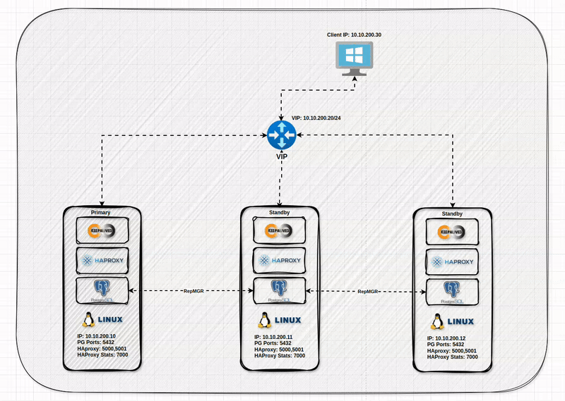

# Setup Postgres Cluster (REPMGR)


## Lab Overview 

This lab will help you to setup and configure a PostgreSQL 16.2, RepMGR 16, HAProxy and Keepalived  on three nodes, to reach the PostgreSQL database high availability.

Requirements:
* Oracle Linux 9 ISO [link](https://yum.oracle.com/oracle-linux-isos.html).
* PostgreSQL 16.2.
*  RepMGR 16.
* Oracle Linux 9 as Client 

| Server      | IP           | PG_Port | VIP          | RO_Port | RW_Port |
| ----------- | ------------ | ------- | ------------ | ------- | ------- |
| ol9-pg1     | 10.10.200.10 | 5432    | 10.10.200.20 | 5001    | 5000    |
| ol9-pg2     | 10.10.200.11 | 5432    | 10.10.200.20 | 5001    | 5000    |
| ol9-pg3     | 10.10.200.12 | 5432    | 10.10.200.20 | 5001    | 5000    |
| ol9-br1  | 10.10.200.13 | 5432    | 10.10.200.20 | 5001    | 5000    |
| Win-pg-Clnt | 10.10.200.14 | N/A     | N/A          | N/A     | N/A     |

Below is the high level design for the PostgreSQL database cluster:



This diagram shows what the network and the connections between the nodes look like:


## Prepare Nodes VMs

### Create Virtualbox Node Install OL9 

Follow this video link on my YouTube channel in order to create a VM and setup Oracle linux 9 server.

### Clone OL9 
Follow this video link on my YouTube channel in order to clone the VM to more 2 VM total 3 VMs. 

### Setup Static IP (ALL)

Follow the Youtube video link to assign Static IP address to 3 nodes.

### Setup Hostname (ALL)

Add the `hostname` you prefer using below command:

```bash
# add hostname 
 sudo hostnamectl set-hostname ol9-pg1
 sudo hostnamectl set-hostname ol9-pg2
 sudo hostnamectl set-hostname ol9-pg3
# add to entry to hosts file 
 cat /etc/hosts
 sudo echo '10.10.200.10    ol9-pg2' >> /etc/hosts
 sudo echo '10.10.200.11    ol9-pg1' >> /etc/hosts
 sudo echo '10.10.200.12    ol9-pg3' >> /etc/hosts
 cat /etc/hosts

```

### Change Machine ID (Cloned Nodes)

```bash
## Node 2 
[admin@ol9-pg2 ~]$
[admin@ol9-pg2 ~]$ sudo rm -f /etc/machine-id
[admin@ol9-pg2 ~]$ sudo rm /var/lib/dbus/machine-id
[admin@ol9-pg2 ~]$ sudo dbus-uuidgen --ensure=/etc/machine-id
[admin@ol9-pg2 ~]$ dbus-uuidgen --get
e5e36d58008875113832db1e665f558f
[admin@ol9-pg2 ~]$

## Node3
[admin@ol9-pg3 ~]$ sudo rm -f /etc/machine-id
[admin@ol9-pg3 ~]$ sudo rm /var/lib/dbus/machine-id
[admin@ol9-pg3 ~]$ sudo dbus-uuidgen --ensure=/etc/machine-id
[admin@ol9-pg3 ~]$ dbus-uuidgen --get
2012976fe5fa19d95ffa08bd665f5596
[admin@ol9-pg3 ~]$
```
### Access Nodes using SSH

Follow this video link on my YouTube channel in order to forward the ssh port to host OS. use any ssh client to access servers.
## Install & Configure PostgreSQL

### Install PostgreSQL (ALL)

```bash
# Install the repository RPM:
sudo dnf install -y https://download.postgresql.org/pub/repos/yum/reporpms/EL-9-x86_64/pgdg-redhat-repo-latest.noarch.rpm  

# Disable the built-in PostgreSQL module:
sudo dnf -qy module disable postgresql

# Install PostgreSQL:
sudo dnf install -y postgresql16-server
```

### Create New Location (ALL)

```bash
# create new location on all nodes for data directory using root
mkdir -p /u01/pgdata/data
chown -R postgres:postgres /u01
chmod -R 700 /u01/pgdata
```

### Edit the Postgres Systemd service (ALL)

```bash
# Edit systemd service 
vim  /lib/systemd/system/postgresql-16.service
# or 
systemctl edit --full postgresql-16
systemctl daemon-reload 
systemctl cat postgresql-16
### edit this line 

# Location of database directory
Environment=PGDATA=/u01/pgdata/data/

# Enable the postgreSQL to startup automatically  
systemctl enable postgresql-16

# to enable and start in one command 
systemctl enable --now postgresql-16

# start service & check status 
systemctl start postgresql-16.service
systemctl status postgresql-16.service
```

### Initialize Database (Primary Only)

The `PGDATA` is an environment variable to set PostgreSQL data directory path location, in this setup the location path is `/u01/pgdata/data` 

```bash
# only on primary initialize the database
sudo PGDATA=/u01/pgdata/data /usr/pgsql-16/bin/postgresql-16-setup initdb 
```

### Migrate Data to New Location (Primary Only)

You can follow below steps to migrate initialized PostgreSQL with the default location to new location. If you are okay with the default location of PostgreSQL **you can skip this part**, below step by step data directory migration:

**Get Data directory and Config file location (Primary Only)**:

```bash
# get the location of data_directory from postgres
su - postgres
psql
psql (16.2)
postgres=# show config_file;
 /var/lib/pgsql/16/data/postgresql.conf

postgres=# show data_directory;
 /var/lib/pgsql/16/data
```

**Stop Postgres Systemd Service (Primary Only)**

Stop the `postgresql-16` `systemd` service:

```bash
# postgres stop service 
systemctl start postgresql-16.service
# if enabled you need to disable it
systemctl disable postgresql-16.service
```

**Move Data to New Location (Primary Only)**

```bash
su - postgres
rsync -av /var/lib/pgsql/16/data/ /u01/pgdata/data
```

**Add New Location To Config (Primary Only)**

```bash
vim /u01/pgdata/data/postgresql.conf

# add this line 
data_directory = '/u01/pgdata/data'
```

**Edit the Postgres Systemd service (ALL)**

```bash
# Edit systemd service 
vim  /lib/systemd/system/postgresql-16.service

### edit this line 

# Location of database directory
Environment=PGDATA=/u01/pgdata/data

# Enable the postgreSQL to startup automatically  
systemctl enable postgresql-16

# to enable and start in one command 
systemctl enable --now postgresql-16

# start service & check status 
systemctl start postgresql-16.service
systemctl status postgresql-16.service
```

### Check Configuration Taken (Primary Only)

```bash
su - postgres
psql
postgres=# show config_file;
 /u01/pgdata/data/postgresql.conf

postgres=# show data_directory;
 /u01/pgdata/data
```

### Configure PostgreSQL (Primary Only)

Edit the `postgresql.conf` configuration file: 

```bash
cp /u01/pgdata/data/postgresql.conf /u01/pgdata/data/postgresql.conf.bkp
grep -v '^#' /u01/pgdata/data/postgresql.conf.bkp | grep '^[A-Za-z0-9]' > /u01/pgdata/data/postgresql.conf
chown postgres:postgres /u01/pgdata/data/postgresql.conf

vim /u01/pgdata/data/postgresql.conf
# add below configuration

listen_addresses = '0.0.0.0' # ipv4 only 
max_wal_senders = 10
max_replication_slots = 10
wal_level = 'replica' #  or 'logical'
hot_standby = on
archive_mode = on
archive_command = '/bin/true'
# shared_preload_libraries = 'repmgr'
wal_log_hints = on

# start service and enable the service
sudo systemctl enable postgresql-16
sudo systemctl start postgresql-16
sudo systemctl status postgresql-16
```

### Add Postgres Bin Dir to Postgres User PATH (ALL)

Add the postgres `bin` directory to the `PATH` so you can run command directly from terminal: 

```bash
su - postgres
sed -i "s/PGDATA=.*/PGDATA=\/u01\/pgdata\/data/" .bash_profile
vim .bash_profile
export PATH=/usr/pgsql-16/bin:$PATH
# or 
echo "export PATH=/usr/pgsql-16/bin:\$PATH" >> .bash_profile
exit
```

### Allow Postgres Port on Firewall (ALL)

```bash
# need sudo or root user 
firewall-cmd --add-port=5432/tcp --permanent --zone=public
firewall-cmd --reload
firewall-cmd --list-ports
```

## Install & Configure RepMGR

### Install RepMGR (ALL)

```bash
# install replication manager 
sudo dnf install -y repmgr_16
```


### Create RepMGR User & Database (Primary Only)

```bash
su - postgres
createuser -s repmgr
createdb repmgr -O repmgr 

# or need to be checked 
su - postgres
psql -c "CREATE USER repmgr WITH SUPERUSER;"
psql -c "CREATRE DATABASE repmgr OWNER repmgr"
```

### Edit PG_HBA File (Primary Only)

Edit the `pg_hba.conf` configuration file: 

```bash
vim /u01/pgdata/data/pg_hba.conf
# TYPE  DATABASE        USER            ADDRESS          METHOD
local   replication     repmgr                              trust
host    replication     repmgr          10.10.200.0/24          trust
host    replication     repmgr          127.0.0.1/32            trust
local   repmgr          repmgr                              trust
host    repmgr          repmgr          10.10.200.0/24          trust
host    repmgr          repmgr          127.0.0.1/32            trust
```

```sql

```

### Configure RepMGR (ALL)

Backup the original file:

```bash 
ls -l /etc/repmgr/16/repmgr.conf
mv /etc/repmgr/16/repmgr.conf /etc/repmgr/16/repmgr.conf.bkp
```

#### On primary

You need to make sure that below parameters have correct value to do so you need to edit below parameters accordingly:
* node_id
* node_name
* conninfo
* data_direcotry
* pg_bindir
* promote_command
* follow_command
* repmgrd_service_start_command
* repmgrd_service_stop_command
* service_start_command
* service_stop_command
* service_restart_command
* service_reload_command

**Simple Config**:

```bash
vim /etc/repmgr/16/repmgr.conf
node_id=1
node_name=ol9-pg1
conninfo='host=ol9-pg1 user=repmgr dbname=repmgr connect_timeout=2'
data_directory='/var/lib/pgsql/16/data'
failover=automatic
promote_command='repmgr -f /etc/repmgr/16/repmgr.conf standby promote'
follow_command='repmgr -f /etc/repmgr/16/repmgr.conf standby follow'
```

**Advanced Config**:

```bash
vim /etc/repmgr/16/repmgr.conf
node_id=1
node_name='ol9-pg1'
conninfo='host=ol9-pg1 port=5432 user=repmgr dbname=repmgr connect_timeout=2'
data_directory='/u01/pgdata/data' ## chamge this
pg_bindir='/usr/pgsql-16/bin/'
ssh_options='-q -o ConnectTimeout=10'
failover=automatic
promote_command='/usr/pgsql-16/bin/repmgr standby promote -f /etc/repmgr/16/repmgr.conf --log-to-file'
follow_command='/usr/pgsql-16/bin/repmgr standby follow -f /etc/repmgr/16/repmgr.conf --log-to-file --upstream-node-id=%n'
use_replication_slots=true
connection_check_type='ping'
log_file='/var/log/repmgr/repmgr.log'
monitoring_history=yes
log_status_interval=60
primary_visibility_consensus=true
repmgrd_service_start_command='sudo /usr/bin/systemctl start repmgr-16.service'
repmgrd_service_stop_command='sudo /usr/bin/systemctl stop repmgr-16.service'
service_start_command='sudo /usr/bin/systemctl start postgresql-16.service'
service_stop_command='sudo /usr/bin/systemctl stop postgresql-16.service'
service_restart_command='sudo /usr/bin/systemctl restart postgresql-16.service'
service_reload_command='sudo /usr/bin/systemctl reload postgresql-16.service'
```

#### On Standby Nodes

**Simple**

```bash
vim /etc/repmgr/16/repmgr.conf
node_id=2
node_name=ol9-pg2
conninfo='host=ol9-pg2 user=repmgr dbname=repmgr connect_timeout=2'
data_directory='/u01/pg_data/data'
failover=automatic
promote_command='/usr/pgsql-16/bin/repmgr -f /etc/repmgr/16/repmgr.conf standby promote'
follow_command='/usr/pgsql-16/bin/repmgr -f /etc/repmgr/16/repmgr.conf standby follow'
```

```bash
vim /etc/repmgr/16/repmgr.conf
node_id=3
node_name=ol9-pg3
conninfo='host=ol9-pg3 user=repmgr dbname=repmgr connect_timeout=2'
data_directory='/u01/pg_data/data'
failover=automatic
promote_command='/usr/pgsql-16/bin/repmgr -f /etc/repmgr/16/repmgr.conf standby promote'
follow_command='/usr/pgsql-16/bin/repmgr -f /etc/repmgr/16/repmgr.conf standby follow'
```

**Advanced Config**:

```bash
vim /etc/repmgr/16/repmgr.conf
node_id=2
node_name='ol9-pg2'
conninfo='host=ol9-pg2 port=5432 user=repmgr dbname=repmgr connect_timeout=2'
data_directory='/u01/pgdata/data' ## chamge this
pg_bindir='/usr/pgsql-16/bin/'
ssh_options='-q -o ConnectTimeout=10'
failover=automatic
promote_command='/usr/pgsql-16/bin/repmgr standby promote -f /etc/repmgr/16/repmgr.conf --log-to-file'
follow_command='/usr/pgsql-16/bin/repmgr standby follow -f /etc/repmgr/16/repmgr.conf --log-to-file --upstream-node-id=%n'
use_replication_slots=true
connection_check_type='ping'
log_file='/var/log/repmgr/repmgr.log'
monitoring_history=yes
log_status_interval=60
primary_visibility_consensus=true
repmgrd_service_start_command='sudo /usr/bin/systemctl start repmgr-16.service'
repmgrd_service_stop_command='sudo /usr/bin/systemctl stop repmgr-16.service'
service_start_command='sudo /usr/bin/systemctl start postgresql-16.service'
service_stop_command='sudo /usr/bin/systemctl stop postgresql-16.service'
service_restart_command='sudo /usr/bin/systemctl restart postgresql-16.service'
service_reload_command='sudo /usr/bin/systemctl reload postgresql-16.service'
```

```bash
vim /etc/repmgr/16/repmgr.conf
node_id=3
node_name='ol9-pg3'
conninfo='host=ol9-pg3 port=5432 user=repmgr dbname=repmgr connect_timeout=2'
data_directory='/u01/pgdata/data' ## chamge this
pg_bindir='/usr/pgsql-16/bin/'
ssh_options='-q -o ConnectTimeout=10'
failover=automatic
promote_command='/usr/pgsql-16/bin/repmgr standby promote -f /etc/repmgr/16/repmgr.conf --log-to-file'
follow_command='/usr/pgsql-16/bin/repmgr standby follow -f /etc/repmgr/16/repmgr.conf --log-to-file --upstream-node-id=%n'
use_replication_slots=true
connection_check_type='ping'
log_file='/var/log/repmgr/repmgr.log'
monitoring_history=yes
log_status_interval=60
primary_visibility_consensus=true
repmgrd_service_start_command='sudo /usr/bin/systemctl start repmgr-16.service'
repmgrd_service_stop_command='sudo /usr/bin/systemctl stop repmgr-16.service'
service_start_command='sudo /usr/bin/systemctl start postgresql-16.service'
service_stop_command='sudo /usr/bin/systemctl stop postgresql-16.service'
service_restart_command='sudo /usr/bin/systemctl restart postgresql-16.service'
service_reload_command='sudo /usr/bin/systemctl reload postgresql-16.service'
```


### Register Primary Node (Primary Only)

```bash
# using postgres
su - postgres
repmgr primary register

#using root
sudo -u postgres /usr/pgsql-16/bin/repmgr -f /etc/repmgr/16/repmgr.conf primary register
```

Output


```bash
repmgr cluster show
repmgr cluster event
repmgr cluster crosscheck
```

Output


Output


### Clone & Register Standby Nodes (Standby Only)

```bash
# try the dry run from standby node 
 sudo -u postgres /usr/pgsql-16/bin/repmgr -h ol9-pg1 -U repmgr -d repmgr standby clone --dry-run

# you should revieved below message 
INFO: all prerequisites for "standby clone" are met

# clone the primary to standby server
sudo -u postgres /usr/pgsql-16/bin/repmgr -h ol9-pg1 -U repmgr -d repmgr standby clone

# the output 
INFO: executing:
  /usr/pgsql-16/bin/pg_basebackup -l "repmgr base backup"  -D /u01/pgdata/data -h ol9-pg1 -p 5432 -U repmgr -X stream
NOTICE: standby clone (using pg_basebackup) complete
NOTICE: you can now start your PostgreSQL server
HINT: for example: sudo /usr/bin/systemctl start postgresql-16.service
HINT: after starting the server, you need to register this standby with "repmgr standby register"
```

Start Postgres service on standby server

```bash
# start the service and enable the service  
systemct enable postgresql-16
systemct start postgresql-16

# register the standby 
su - postgres
repmgr standby register

# output 
NOTICE: standby node "ol9-pg2" (ID: 2) successfully registered
```

### Passwordless SSH connectivity (ALL)

```bash
# all nodes create a ssh key 
su - postgres
ssh-keygen -t ed25519
vim /var/lib/pgsql/.ssh

# using root user on all nodes 
passwd postgres

# use copy id  on all nodes 
# node 1
su - postgres
ssh-copy-id postgres@ol9-pg2

# node 2 
su - postgres
ssh-copy-id postgres@ol9-pg1

# node 3
# node 2 
su - postgres
ssh-copy-id postgres@ol9-pg3

# using root remove password
passwd -d postgres

```

### Grant PostgreSQL Privilege to control services (ALL) 

```bash
# add below file to sudoers using root  
sudo visudo -f /etc/sudoers.d/postgres

# Allow postgres user to manage postgresql-16.service
postgres ALL=(ALL) NOPASSWD: /usr/bin/systemctl start postgresql-16.service, \
                               /usr/bin/systemctl stop postgresql-16.service, \
                               /usr/bin/systemctl reload postgresql-16.service, \
                               /usr/bin/systemctl restart postgresql-16.service, \
                               /usr/bin/systemctl status postgresql-16.service

# Allow postgres user to manage repmgr-16.service
postgres ALL=(ALL) NOPASSWD: /usr/bin/systemctl start repmgr-16.service, \
                               /usr/bin/systemctl stop repmgr-16.service, \
                               /usr/bin/systemctl reload repmgr-16.service, \
                               /usr/bin/systemctl restart repmgr-16.service, \
                               /usr/bin/systemctl status repmgr-16.service


# Not secure : add postgres to wheel group 
sudo usermod -aG wheel postgres
visudo
##### comment and uncomment samilar to below editing
## Allows people in group wheel to run all commands
# %wheel        ALL=(ALL)       ALL

## Same thing without a password
%wheel  ALL=(ALL)       NOPASSWD: ALL

# you can remove postgres from wheel group 
# check the groups 
groups postgres

gpasswd -d postgres wheel 


```


### Start RepMGR Service (ALL)

```bash 
sudo systemctl enable --now repmgr-16
```

### RepMGR Commands 

You can find all the commands under this [link](https://www.repmgr.org/docs/5.3/index.html)


## Scenarios & Test-Cases 

### Test Replication

```bash
# connect to secondary and check 
# first Secondary 
[postgres@ol9-pg2 ~]$ psql 'host=ol9-pg2 port=5432 user=repmgr dbname=repmgr connect_timeout=2'
\l
# second Secondary 
[postgres@ol9-pg3 ~]$ psql 'host=ol9-pg3 port=5432 user=repmgr dbname=repmgr connect_timeout=2'
\l

# create a database on primary 
su - postgres 
createdb testdb

# Check secondaries again by running below psql command 
\l

# then cleanup the database by running this command 
dropdb testdb 

```

### Test Switchover 

```bash
# monitor all the repmgr.log on all nodes 
tail -f /var/log/repmgr/repmgr.log

# from standby server or node 
# --sbiligs-follow if you have more than on standby
repmgr standby switchover --siblings-follow --dry-run 

```

### Test Failover

```bash

# make sure the service ready for automatic failover 
repmgr service status 

# if the pausing is yes make it no 
repmgr service unpause 

# stop service on primary the standby will be promoted
sudo systemctl stop postgresql-16 
```

### Test Rejoin Failed Node

```bash
# on old primary
# wal_log_hints = on
# make sure the host=ol9-pg1 is the new primary
repmgr node rejoin -d "host=ol9-pg1 port=5432 user=repmgr dbname=repmgr connect_timeout=2" --force-rewind --verbose --dry-run 
```

## Setup HAProxy  (ALL)

**HAProxy** (High Availability Proxy) is an open-source software widely used for load balancing and high availability. It is designed to distribute incoming network traffic across multiple backend servers, improving the performance, reliability, and scalability of web applications and services.

**Common Use Cases:**
1. Web Application Load Balancing.
2. API Gateway.
3. Failover and Redundancy.
4. SSL Offloading.
### Install HAProxy (ALL)

```bash
sudo dnf install haproxy
```

Install the `postgresql-16` if you are setup HAProxy service not on PostgreSQL servers:

```bash
sudo dnf install postgresql-16
```

### Configure HAProxy (ALL)

```bash
# backup the original file before we start adding ours.
mv /etc/haproxy/haproxy.cfg /etc/haproxy/haproxy.cfg.orig
```

```bash
su - postgres
psql
```

```sql
CREATE USER haproxy WITH PASSWORD 'mypassword';
GRANT SELECT ON ALL TABLES IN SCHEMA public TO haproxy;
GRANT CONNECT ON DATABASE postgres TO haproxy;
```

```bash 
/u01/pgdata/data/pg_hba.conf
host    postgres        haproxy      10.10.200.0/24      trust
```

```bash
# connect to haproxy user 
psql -h ol9-pg1 -U haproxy -d postgres
```

To generate a HAProxy configuration file, you can check this GitHub Repo [link](https://github.com/gplv2/haproxy-postgresql) which allow you using python script to create a PostgreSQL HAProxy configuration automatically, below my HAProxy configuration feel free to edit and use it as well:

```bash
sudo vim /etc/haproxy/haproxy.cfg

# add below config to the haproxy.cfg file 

global
		log /dev/log    local0 info alert
		log /dev/log    local1 notice alert
        stats socket /var/lib/haproxy/admin.sock mode 660 level admin expose-fd listeners
        stats timeout 30s
        user haproxy
        group haproxy
        daemon

        # Default SSL material locations
        ca-base /etc/ssl/certs
        crt-base /etc/ssl/private

        # See: https://ssl-config.mozilla.org/#server=haproxy&server-version=2.0.3&config=intermediate
        ssl-default-bind-ciphers ECDHE-ECDSA-AES128-GCM-SHA256:ECDHE-RSA-AES128-GCM-SHA256:ECDHE-ECDSA-AES256-GCM-SHA384:ECDHE-RSA-AES256-GCM-SHA384:ECDHE-ECDSA-CHACHA20-POLY1305:ECDHE-RSA-CHACHA20-POLY1305:DHE-RSA-AES128-GCM-SHA256:DHE-RSA-AES256-GCM-SHA384
        ssl-default-bind-ciphersuites TLS_AES_128_GCM_SHA256:TLS_AES_256_GCM_SHA384:TLS_CHACHA20_POLY1305_SHA256
        ssl-default-bind-options ssl-min-ver TLSv1.2 no-tls-tickets

        # Stuff for ol9-pg
        maxconn 100
        external-check
        #insecure-fork-wanted

defaults
        log     global
        mode    tcp
        retries 2
        option  dontlognull
        timeout connect 4s
        timeout client  50000
        timeout server  50000
        timeout check 5s
#        errorfile 400 /etc/haproxy/errors/400.http
#        errorfile 403 /etc/haproxy/errors/403.http
#        errorfile 408 /etc/haproxy/errors/408.http
#        errorfile 500 /etc/haproxy/errors/500.http
#        errorfile 502 /etc/haproxy/errors/502.http
#        errorfile 503 /etc/haproxy/errors/503.http
#        errorfile 504 /etc/haproxy/errors/504.http


listen stats
        mode http
        bind *:7000
        stats enable
        stats refresh 5s
        stats uri /

frontend frontend_readwrite
         mode tcp
        bind *:5000

        acl pg_single_master nbsrv(backend_readwrite) eq 1
        tcp-request connection reject if !pg_single_master
       default_backend backend_readwrite

frontend frontend_readonly
        mode tcp
        bind *:5001

        default_backend backend_readonly

backend backend_readwrite
        option tcp-check
        tcp-check connect

# user: haproxy
# database: postgres
#
        tcp-check send-binary 00000028                 # packet length     ( 4 bytes )
        tcp-check send-binary 00030000                 # protocol version  ( 4 bytes )
        tcp-check send-binary 7573657200               # "user"            ( 5 bytes )
        tcp-check send-binary 686170726f787900         # "haproxy"         ( 8 bytes )
        tcp-check send-binary 646174616261736500       # "database"        ( 9 bytes )
        tcp-check send-binary 706f73746772657300       # "postgres"        ( 9 bytes )
        tcp-check send-binary 00                       # terminator        ( 1 byte )

# expect: Auth
#
        tcp-check expect binary 52                     # Auth request
        tcp-check expect binary 00000008               # packet length     ( 8 bytes )
        tcp-check expect binary 00000000               # auth response ok

# write: run simple query
# "select pg_is_in_recovery();"
#
        tcp-check send-binary 51                       # simple query
        tcp-check send-binary 00000020                 # packet length     ( 4 bytes)
        tcp-check send-binary 73656c65637420           # "select "         ( 7 bytes )
        tcp-check send-binary 70675f69735f696e5f7265636f7665727928293b    # "pg_is_in_recovery();"  ( 20 bytes )
        tcp-check send-binary 00 # terminator                                 ( 1 byte )


    # write: terminate session
        tcp-check send-binary 58                       # Termination packet
        tcp-check send-binary 00000004                 # packet length: 4 (no body)
    # avoids :  <template1-pgc-2019-01-18 11:23:06 CET>LOG:  could not receive data from client: Connection reset by peer

# expect: Row description packet
#
        tcp-check expect binary 54                         # row description packet (1 byte)
        tcp-check expect binary 0000002a               # packet length: 42 (0x2a)
        tcp-check expect binary 0001                   # field count: 1
        tcp-check expect binary 70675f69735f696e5f7265636f7665727900 # field name: pg_is_in_recovery
        tcp-check expect binary 00000000               # table oid: 0
        tcp-check expect binary 0000                   # column index: 0
        tcp-check expect binary 00000010               # type oid: 16
         tcp-check expect binary 0001                   # column length: 1
        tcp-check expect binary ffffffff               # type modifier: -1
        tcp-check expect binary 0000                   # format: text

# expect: query result data
#
# "f" means node in master mode               66h
# "t" means node in standby mode (read-only)  74h
#
        tcp-check expect binary 44                     # data row packet
        tcp-check expect binary 0000000b               # packet lenght: 11 (0x0b)
        tcp-check expect binary 0001                   # field count: 1
        tcp-check expect binary 00000001               # column length in bytes: 1
        tcp-check expect binary 66                     # column data, "f"

# write: terminate session
        tcp-check send-binary 58                       # Termination packet
        tcp-check send-binary 00000004                 # packet length: 4 (no body)

        default-server on-marked-down shutdown-sessions

        server ol9-pg1 ol9-pg1:5432 check inter 5000 fastinter 2000 downinter 5000 rise 2 fall 3
        server ol9-pg2 ol9-pg2:5432 check inter 5000 fastinter 2000 downinter 5000 rise 2 fall 3
        server ol9-pg3 ol9-pg3:5432 check inter 5000 fastinter 2000 downinter 5000 rise 2 fall 3

backend backend_readonly
        option tcp-check
        tcp-check connect

# user: pgc
# database: template1
#
        tcp-check send-binary 00000028                 # packet length     ( 4 bytes )
        tcp-check send-binary 00030000                 # protocol version  ( 4 bytes )
        tcp-check send-binary 7573657200               # "user"            ( 5 bytes )
        tcp-check send-binary 686170726f787900         # "haproxy"         ( 8 bytes )
        tcp-check send-binary 646174616261736500       # "database"        ( 9 bytes )
        tcp-check send-binary 706f73746772657300       # "postgres"        ( 9 bytes )
        tcp-check send-binary 00                       # terminator        ( 1 byte )

# expect: Auth
#
        tcp-check expect binary 52                     # Auth request
        tcp-check expect binary 00000008               # packet length     ( 8 bytes )
        tcp-check expect binary 00000000               # auth response ok

# write: run simple query
# "select pg_is_in_recovery();"
#
        tcp-check send-binary 51                       # simple query
        tcp-check send-binary 00000020                 # packet length     ( 4 bytes)
        tcp-check send-binary 73656c65637420           # "select "         ( 7 bytes )
    # "pg_is_in_recovery();"
        tcp-check send-binary 70675f69735f696e5f7265636f7665727928293b    #   ( 20 bytes )
        tcp-check send-binary 00 # terminator                                 ( 1 byte )

    # write: terminate session
        tcp-check send-binary 58                       # Termination packet
        tcp-check send-binary 00000004                 # packet length: 4 (no body)
    # avoids :  <template1-pgc-2019-01-18 11:23:06 CET>LOG:  could not receive data from client: Connection reset by peer

# expect: Row description packet
#
        tcp-check expect binary 54                         # row description packet (1 byte)
        tcp-check expect binary 0000002a               # packet length: 42 (0x2a)
        tcp-check expect binary 0001                   # field count: 1
        tcp-check expect binary 70675f69735f696e5f7265636f7665727900 # field name: pg_is_in_recovery
        tcp-check expect binary 00000000               # table oid: 0
        tcp-check expect binary 0000                   # column index: 0
        tcp-check expect binary 00000010               # type oid: 16
        tcp-check expect binary 0001                   # column length: 1
        tcp-check expect binary ffffffff               # type modifier: -1
        tcp-check expect binary 0000                   # format: text

# expect: query result data
#
# "f" means node in master mode               66h
# "t" means node in standby mode (read-only)  74h
#
        tcp-check expect binary 44                     # data row packet
        tcp-check expect binary 0000000b               # packet lenght: 11 (0x0b)
        tcp-check expect binary 0001                   # field count: 1
        tcp-check expect binary 00000001               # column length in bytes: 1
        tcp-check expect binary 74                     # column data, "t"

# write: terminate session
        tcp-check send-binary 58                       # Termination packet
        tcp-check send-binary 00000004                 # packet length: 4 (no body)

        default-server on-marked-down shutdown-sessions

        server ol9-pg1 ol9-pg1:5432 check inter 5000 fastinter 2000 downinter 5000 rise 2 fall 3
        server ol9-pg2 ol9-pg2:5432 check inter 5000 fastinter 2000 downinter 5000 rise 2 fall 3
        server ol9-pg3 ol9-pg3:5432 check inter 5000 fastinter 2000 downinter 5000 rise 2 fall 3

```

### Set SELinux to Permissive or Disable (ALL)

```bash
# change the selinux configuration
cat /etc/selinux/config

sudo sed -i s/SELINUX=.*/SELINUX=permissive/g /etc/selinux/config

setenforce 0
getenforce
```

### Allow HAProxy on Firewall (ALL)

```bash
# need sudo or root user 
firewall-cmd --add-port=7000/tcp --permanent --zone=public
firewall-cmd --add-port=5000/tcp --permanent --zone=public
firewall-cmd --add-port=5001/tcp --permanent --zone=public
firewall-cmd --reload
firewall-cmd --list-ports
```
### Enable & Start Service (ALL)

```bash
systemctl enable --now haproxy
systemctl status  haproxy
```

http://127.0.0.1:7000

## KeepAliveD

Keepalived is an open-source software suite designed to provide high availability (HA) and load balancing for Linux systems. It is commonly used to ensure that network services remain accessible even if one or more servers fail.

Here’s a key components of KeepaliveD:

1. **VRRP (Virtual Router Redundancy Protocol)**.
2. **LVS (Linux Virtual Server)**.
3. **Health Checking**.

The role of Keepalived is crucial for maintaining high availability and ensuring seamless failover. Here's a detailed look at Keepalived's role:

1. High Availability:
	* **Virtual IP Management**
	- **Failover Handling**

### Install Keepalived (ALL)

```bash
sudo dnf install -y keepalived
```

### Configure Keepalived (ALL)

```bash
mv /etc/keepalived/keepalived.conf /etc/keepalived/keepalived.conf.orig
```

We need to get the network details from all the nodes it will help us later on, during our configuration for keepalived service. 

```bash
# try to get the interface name and the IP
ip -br a 
```

Start editing the `keepalived` service using the `keepalived.conf` file.

```bash
vim /etc/keepalived/keepalived.conf
```

```bash
# Virtual Router Redundancy Protocol (VRRP)
# === Node 1 
vrrp_script chk_haproxy {  
	script "/usr/bin/killall -0 haproxy" # check if HAProxy is running  
	interval 2 # check every 2 second  
	weight 4 # weight to influence master election  
}  
vrrp_instance vi_pg1 {  
	state MASTER  
	interface enp0s3  
	virtual_router_id 51  
	priority 102  
	advert_int 1  
	unicast_src_ip 10.10.200.10 
	unicast_peer {  
		10.10.200.11
		10.10.200.12 
	}  
	authentication {  
		auth_type PASS  
		auth_pass Password  
	}  
  
	virtual_ipaddress {  
		10.10.200.20/24 
	}
	track_script {  
		chk_haproxy  
	}  
} 
```

```bash
# Virtual Router Redundancy Protocol (VRRP)
#=== Node 2
vrrp_script chk_haproxy {  
	script "/usr/bin/killall -0 haproxy" # check if HAProxy is running  
	interval 2 # check every 2 second  
	weight 4 # weight to influence master election  
}  
vrrp_instance vi_pg1 {  
	state BACKUP  
	interface enp0s3  
	virtual_router_id 51  
	priority 101  
	advert_int 1  
	unicast_src_ip 10.10.200.11  
	unicast_peer {  
		10.10.200.10
		10.10.200.12
	}  
	authentication {  
		auth_type PASS  
		auth_pass Password  
	}  
  
	virtual_ipaddress {  
		10.10.200.20/24 
	}
	track_script {  
		chk_haproxy  
	}	
}
```


```bash

#=== Node 3
vrrp_script chk_haproxy {  
	script "/usr/bin/killall -0 haproxy" # check if HAProxy is running  
	interval 2 # check every 2 second  
	weight 4 # weight to influence master election  
}  
vrrp_instance vi_pg1 {  
	state BACKUP  
	interface enp0s3  
	virtual_router_id 51  
	priority 100 
	advert_int 1  
	unicast_src_ip 10.10.200.12  
	unicast_peer {  
		10.10.200.10
		10.10.200.11  
	}  
  
	authentication {  
		auth_type PASS  
		auth_pass Password  
	}  
	virtual_ipaddress{  
		10.10.200.20/24  
	}
	track_script {  
		chk_haproxy  
	}	 
}  
```

### Test and start Keepalived

```bash
sudo keepalived -t
sudo systemctl enable --now keepalived # enable and start
sudo systemctl start keepalived
sudo systemctl status keepalived
```

```bash
# read write connection 5000 is haproxy readwrite backend
psql "host=10.10.200.20 port=5000 user=repmgr dbname=repmgr"
select inet_server_addr();

# read only connection 5001 is haproxy readonly backend
psql "host=10.10.200.20 port=5001 user=repmgr dbname=repmgr"
select inet_server_addr();

```


## Test the High Availability & Fail-Over Scenarios

This diagram shows how HAProxy and Keepalived are configured, so we need to perform a test with many test cases to make sure those configurations meet our expectations and this setup is ready for production.


### Test Switchover Using RepMGR

```
repmgr standby switchover --siblings-follow --dry-run 

repmgr standby switchover --siblings-follow 
```


### Test HAProxy

In this test the HAProxy is working fine on the three nodes, the test will be like, connect PostgreSQL servers from all HAProxy and using connection strings and the Port 5000 and 5001 I have scripted the test you need only to change the parameters to fit your environment in case you are using hostnames and ports not similar to what I have.

```bash
# check the /etc/hosts on all nodes that contains the hostname and ip addresses

cat /etc/hosts
```

Create a test database

```sql
------ using terminal 
createuser -s -P TestUser
createdb Testdb -O TestUser

------ using psql
-- Step 1: Create a new user
CREATE USER TestUser WITH PASSWORD 'Password123';

-- Step 2: Create a new database (if needed)
CREATE DATABASE TestDatabase;

-- Step 3: Grant connect privilege to the user on the new database
GRANT CONNECT ON DATABASE TestDatabase TO TestUser;

-- Step 4: Grant usage on the public schema (optional)
GRANT USAGE ON SCHEMA public TO TestUser;

-- Step 5: Grant all privileges on all tables in the public schema (optional)
GRANT ALL PRIVILEGES ON ALL TABLES IN SCHEMA public TO TestUser;

```

add record to`pg_hba.conf` for the `testuser` and `testdb` database 

```bash
host    Testdb        TestUser         10.10.200.0/24          scram-sha-256
```

copy the `pg_hba.conf` to the other nodes:

```bash
scp /u01/pgdata/data/pg_hba.conf ol9-pg2:/u01/pgdata/data/pg_hba.conf

scp /u01/pgdata/data/pg_hba.conf ol9-pg3:/u01/pgdata/data/pg_hba.conf
```

Reload postgreSQL `systemd` service on all nodes:

```bash
systemctl reload postgresql-16.service
```

try to connect to `Testdb` using `TestUser` 

```bash
psql -h ol9-pg1 -U TestUser -d Testdb
```

```bash 
#!/bin/bash

# This script checks the reachability of PostgreSQL and HAProxy servers.

# List of PostgreSQL servers (hostname:port)
PG_NODES=(
    "ol9-pg1:5432"
    "ol9-pg2:5432"
    "ol9-pg3:5432"
    "ol9-pg1:5000"
    "ol9-pg2:5000"
    "ol9-pg3:5000"
    "ol9-pg1:5001"
    "ol9-pg2:5001"
    "ol9-pg3:5001"
    "ol9-pg-vip:5432"
    "ol9-pg-vip:5000"
    "ol9-pg-vip:5001"
)

# List of HAProxy servers (hostname:port)
HAPXY_NODES=(
    "ol9-pg1:7000"
    "ol9-pg2:7000"
    "ol9-pg3:7000"
    "ol9-pg-vip:7000"
)

# Function to check reachability of a PostgreSQL server
# Arguments:
#   $1: server - The server address in the format hostname:port
check_pg_server() {
    local server=$1
    local host=$(echo $server | cut -d':' -f1)
    local port=$(echo $server | cut -d':' -f2)

    # Check if the server is reachable using pg_isready
    pg_isready -h $host -p $port > /dev/null 2>&1
    if [ $? -eq 0 ]; then
        echo "[+] Server ($server): Reachable."
    else
        echo "[-] Server ($server): Not Reachable."
    fi
}

# Function to check reachability of an HAProxy server
# Arguments:
#   $1: server - The server address in the format hostname:port
check_haproxy_server() {
    local server=$1
    local host=$(echo $server | cut -d':' -f1)
    local port=$(echo $server | cut -d':' -f2)

    # Check if the server is reachable using /dev/tcp
    (echo > /dev/tcp/$host/$port) > /dev/null 2>&1
    if [ $? -eq 0 ]; then
        echo "[+] HAProxy Server ($server): Reachable."
    else
        echo "[-] HAProxy Server ($server): Not Reachable."
    fi
}

# Main script execution
# Check PostgreSQL servers
echo "Checking PostgreSQL servers..."
for server in "${PG_NODES[@]}"; do
    check_pg_server $server
done

# Check HAProxy servers
echo "Checking HAProxy servers..."
for server in "${HAPXY_NODES[@]}"; do
    check_haproxy_server $server
done

```

### Test Keepalived 

Before we start the `keepalived` testing, we need to know that `keepalived` relies on `haproxy` means that the `keepalived` master server will keep checking the `haproxy` availability constantly. If the `haproxy` is not available, the `keepalived` will fail-over to another  `keepalived` node that has a higher priority weight, and the `haproxy` is available there.


```bash
# stop HAProxy on the Keepalived master node 
sudo systemctl stop haproxy

# check the keepalived if its failed to another keepalived backup server where haproxy is available there.


```


## BARMAN Backup/Recovery

In this setup I will introduce you with a solution for Performing back up that will allow Point-In-Time Recovery using barman. This part of my documentation taken from this article [link](https://medium.com/@kiwiv/postgresql-replication-backup-with-repmgr-barman-a8098748b98c).

There are several methods for backing a PostgreSQL database up. You can find more information at this [Link](https://www.postgresql.org/docs/10/static/backup.html) .

- Backup using pg_dump or pgdump_all: this solution is the most simple of all but doesn’t perform well for large database. It also would not allow you to perform a fine grained backup and you will not be able to recover data that happened *after the backup*. If you backup using a cronjob every night at 4:00 AM, and an accident happen at 4:00 PM the same day, you would have lost 12 hours of data.
- In our case we are interested in **Continuous Archiving and Point-in-Time Recovery (PITR)** which would allow us to recover our database to any point in time. This is obviously a better solution than pg_dump but requires much more knowledge of PostgreSQL and more configuration. It also does not allow to fine tune the backup on a per database basis, the backup happens for the whole cluster and so is the recovery.

### Install Barman on Barman Server

```bash
sudo dnf -y install barman barman-cli postgresql16
```

Add the PostgreSQL binary directory to PATH in bash profile:

```bash
# if bash profile is not added run below command using barman 
cp /etc/skel/.bash_profile ~/

# add below line 
echo "export PATH=/usr/pgsql-16/bin:\$PATH" >> .bash_profile

# check the profile content 
cat ~/.bash_profile

source ~/.bash_profile
```

Change the backup Directory on the server to another location:

```bash
mkdir -p /u02/backups
chown -R barman:barman /u02/

vim /etc/barman.conf
barman_home = /u02/backups
```

### Add Entry to Host File \[ALL]

```bash
# on Barman server using sudo or root user
vim /etc/hosts

10.10.200.10    ol9-pg1
10.10.200.11    ol9-pg2
10.10.200.12    ol9-pg3
10.10.200.13    ol9-br1
10.10.200.20    ol9-pg-vip

# on Postgres Nodes
10.10.200.13    ol9-br1
```

### Configure Passwordless Connection \[ALL]

```bash
# on barman server using barman user 
ssh-keygen -t ed25519

# cat public id 
cat .ssh/id_ed25519.pub

# on barman server using barman user 
vim .ssh/authorized_keys

ssh postgres@ol9-pg

ssh barman@ol9-br1

```


### Create Barman & Streaming_Barman users \[Primary]

Connect to PostgreSQL primary node and create two users as shown below:

```bash
# su - postgres 
repmgr cluster show

# run below to create a users for barman 
createuser -P --replication streaming_barman
createuser -P -s barman
```

### Edit PG_HBA File \[ALL] 

Add two users to all the `pg_hba` files on each node you have, we have three nodes we need to add this to three nodes:

```bash
# add below lines to the pg_hba.conf
vim /u01/pgdata/data/pg_hba.conf
 
host    replication     streaming_barman 10.10.200.0/24         scram-sha-256
host    postgres        barman          10.10.200.0/24          scram-sha-256
```

Copy the `pg_hba.conf` to the other nodes 

```bash
# node 2
scp /u01/pgdata/data/pg_hba.conf ol9-pg2:/u01/pgdata/data/pg_hba.conf

# node 3 
scp /u01/pgdata/data/pg_hba.conf ol9-pg3:/u01/pgdata/data/pg_hba.conf

```

Reload the `systemd` service on all nodes 

```bash
 sudo systemctl reload postgresql-16.service
 ssh ol9-pg2 sudo systemctl reload postgresql-16.service
 ssh ol9-pg3 sudo systemctl reload postgresql-16.service
```

### Add PGPASS to Barman Home \[ALL]

From barman user create a file called `.pgpass`:- 

```bash
vim ~/.pgpass
*:5000:*:barman:Password123
*:5000:*:streaming_barman:Password123
```

Then Change the access permission on `.pgpass` as shown below:

```bash
chmod 0600 .pgpass
```

Then we can test the connection from barman server to PostgreSQL servers by running these commands :

```bash
psql -c 'SELECT version()' -U barman -h 10.10.200.20 -d postgres -p 5000

psql -U streaming_barman -h 10.10.200.20 -p 5000   -c "IDENTIFY_SYSTEM"   replication=1
```

### Configure PostgreSQL Config \[ALL]

On three nodes make sure these parameters are available in `postgresql.conf` file:

```bash
# check config files 
grep -iE '(^wal_le|^max_.*_send|^max_re)' /u01/pgdata/data/postgresql.conf

ssh ol9-pg2 "grep -iE '(^wal_le|^max_.*_send|^max_re)' /u01/pgdata/data/postgresql.conf"

ssh ol9-pg3 "grep -iE '(^wal_le|^max_.*_send|^max_re)' /u01/pgdata/data/postgresql.conf"

wal_level = replica
max_wal_senders = 10
max_replication_slots = 10
```

### Configure Barman Server

I'm using here the connection for `keepalived` VIP and `HAProxy` port.

```bash
# check the content of this file 
vim /etc/barman.d/demobackup1.conf

[DemoBackup1]
active = true
description = "PostgreSQL for Demo Backup Backup Policy"
conninfo = host=ol9-pg-vip port=5000 user=barman dbname=postgres
streaming_conninfo = host=ol9-pg-vip port=5000 user=streaming_barman dbname=replication
backup_directory = /u02/backups/demobackup1
backup_method = postgres
streaming_archiver = on
slot_name = barman_pg_demo1
create_slot = auto
retention_policy = 'RECOVERY WINDOW OF 10 DAYS'
```


### Check Barman Backup Setup \[ALL]

```bash

# u need to be barman user to run below commands 
su - barman

# you may find some errors don't panic
barman check DemoBackup1

# create slot
barman receive-wal --create-slot DemoBackup1

# check if the slot is created 
barman replication-status DemoBackup1

# create cron to create the slot if not  
barman cron

# check again 
barman replication-status DemoBackup1


# check the status 
barman check DemoBackup1


# switch the wal to backup it 
barman switch-wal --force --archive DemoBackup1

# psql -h ol9-pg -U repmgr -d repmgr
 SELECT * FROM repmgr.nodes;
 SELECT * FROM pg_stat_replication;

# Take a base backup
barman backup DemoBackup1
barman list-backups DemoBackup1
```


### Configure RepMgr with Barman \[ALL]

On three nodes you need to install `barman-cli`

```bash
sudo dnf install barman-cli
sudo systemctl restart  repmgr-16.service
systemctl status repmgr-16.service
```


```bash
# add below lines 
vim /etc/repmgr/16/repmgr.conf
barman_host='barman@ol9-br1'
barman_server='DemoBackup1'
restore_command='/usr/bin/barman-wal-restore -U barman ol9-br1 DemoBackup1 %f %p'

sudo systemctl reload  repmgr-16.service
systemctl status repmgr-16.service
```

### Recover Node From Failure

```bash
# monitor barman backup server 
tail -100f /var/log/barman/barman.log

# monitor standby servers 
tail -f /var/log/repmgr/repmgr.log

# on primary stop postgres to mimic the failure 
sudo systemctl stop postgresql-16.service

# from new primary check the status 
repmgr cluster show

# from failed primary
repmgr -h ol9-pg2 -U  repmgr -d repmgr -F standby clone --dry-run

# then force the clone from the barman server to recover
repmgr -h ol9-pg3 -U  repmgr -d repmgr -F standby clone

# start postgres
sudo systemctl start postgresql-16.service

# register the node as standby 
repmgr standby -F register

# check the cluster
repmgr cluster show

```

#### Crontab

```bash
vim DemoBackup1.sh

#!/bin/bash

# Define variables
BACKUP_LOG="/var/log/barman/backup-$(date +\%F%H%M%S).log"
BARMAN_CMD="/usr/bin/barman"
SERVER_NAME="DemoBackup1"

# Perform the backup
$BARMAN_CMD backup $SERVER_NAME > $BACKUP_LOG 2>&1

# Check if the backup was successful
if [ $? -eq 0 ]; then
  echo "$(date +\%F\ %T): Backup successful" >> $BACKUP_LOG
else
  echo "$(date +\%F\ %T): Backup failed" >> $BACKUP_LOG
fi


chmod +x DemoBackup1.sh

crontab -e 

0 0 * * * /path_of_script/DemoBackup1.sh

# ConnectionString
Pooling=false;Timeout=300;CommandTimeout=300;KeepAlive=300;Include Error Detail=True;
```


### Point In Time Recovery 

```bash
barman recover --remote-ssh-command="ssh postgres@ol9-pg3" \
DemoBackup1 --target-time "2024-08-29 11:00" /u01/pgdata/data
```

# Create User

```bash
psql> create tablespace data_tbs location '/u01/pgts/';  
psql> create user dbuser login superuser password 'dbuser123';  
psql> create database db1 owner dbuser tablespace data_tbs;  
psql> \c db1  
psql> create schema authorization aiuser;
```


``

